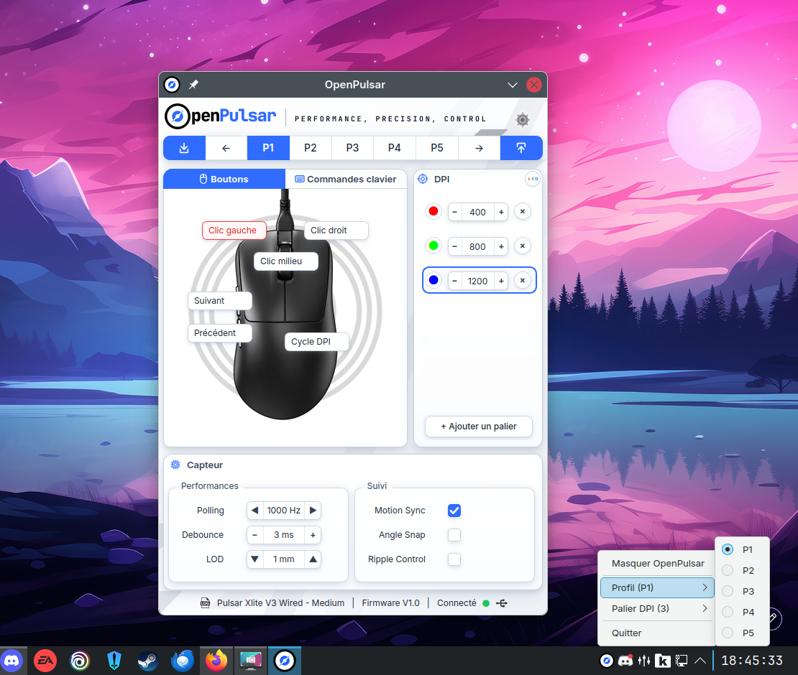

<p align="center">
  
</p>

<h1 align="center">OpenPulsar</h1>

<p align="center"><strong>Open-source configuration utility for Pulsar wired gaming mice on Linux.</strong></p>

<p align="center">
  <a href="https://github.com/Andalrick/OpenPulsar/actions/workflows/tests.yml"></a>
  <a href="LICENSE"></a>
  
  
  <a href="https://discord.gg/VghxVFVUUQ"></a>
</p>

<p align="center">
  
</p>

## Features

- Five onboard profiles
- DPI stages and active DPI selection
- Polling rate, debounce and lift-off distance
- Motion Sync, Angle Snap and Ripple Control
- Mouse-button remapping and keyboard commands
- RGB LED controls on supported devices
- Profile import and export
- System-tray controls for profiles and DPI stages
- English, French, German and Spanish interface translations

## Supported devices

| Device | USB PID | Status |
|---|---:|:---:|
| Pulsar Xlite V3 Wired — Medium | `0x1401` | ✅ |
| Pulsar X2 Wired | `0x1402` | ⚠️ Provisional PID |
| Pulsar X2H Wired | `0x1403` | ✅ |
| Pulsar X2A Wired | `0x1404` | ✅ |

All currently supported devices use Pulsar vendor ID `0x3710` and the Sonix Gen1 wired protocol.

## Installation

Packaged installation instructions will be added with the first binary release. Until then, OpenPulsar can be run from source.

### Run from source

Requirements:

- Linux
- Python 3.12 or newer
- access to the mouse HID interface

```bash
git clone https://github.com/Andalrick/OpenPulsar.git
cd OpenPulsar

python3 -m venv .venv
source .venv/bin/activate
python -m pip install --upgrade pip
python -m pip install -e .

openpulsar
```

The temporary development launcher remains available as:

```bash
./run.sh
```

## Tests

Install the test dependencies and run the hardware-free test suite:

```bash
python -m pip install -e '.[test]'
pytest
```

The GUI smoke tests are skipped automatically when Qt cannot initialize. Real-device validation remains manual.

## Contributing

Bug reports, tested device information and code contributions are welcome. Please read [CONTRIBUTING.md](CONTRIBUTING.md) before opening a pull request.

For compatibility questions, hardware testing and protocol research, join the [OpenPulsar Discord community](https://discord.gg/VghxVFVUUQ).

## Disclaimer

OpenPulsar is an independent community project. It is not affiliated with, endorsed by or sponsored by Pulsar Gaming Gears.

## License

OpenPulsar is licensed under the [GNU General Public License v3.0 or later](LICENSE).
